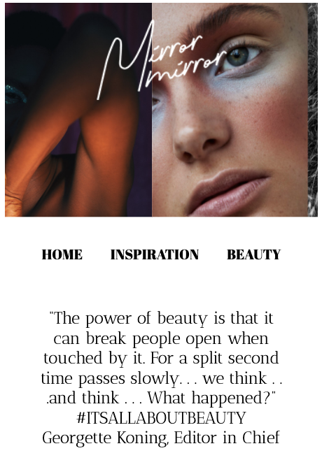

 ## HERKANSING

 Ik heb alle feedback verwerkt. Ik heb meer interactieve elementen toegevoegd op de home page, hier heb ik een hover over alle covers gedaan en doorverwezen naar een nieuwe pagina en de video is gelinkt met youtube. 
 Op de inspiration pagina heb ik een popupmelding toegevoegd met de button 'sign up'. Op deze pagina heb ik ook een hover op de afbeeldingen en de titels gezet. Hier kan op geklikt worden en deze worden naar de nieuwe pagina verwezen.  
 Op de nieuwe photoshoot 'ray of light' pagina heb ik ook de button toegevoegd en dezelfde hover als op de homepage. 

 De headings in de sections zijn toegevoegd, de h1's zijn aan alle pagina's toegevoegd en er kan niet meer op de slider geklikt worden die het beeld dan blokt. 

**Screenshot(s):**

 # Procesverslag
-Anousha van Leent-

Markdown cheat cheet: [Hulp bij het schrijven van Markdown](https://github.com/adam-p/markdown-here/wiki/Markdown-Cheatsheet). Nb. de standaardstructuur en de spartaanse opmaak zijn helemaal prima. Het gaat om de inhoud van je procesverslag. Besteedt de tijd voor pracht en praal aan je website.

## Bronnenlijst
<!-- afbeeldingen, tekst, video -->
1. https://www.mirror-mirror.nl/ 
<!-- gebruikte fonts -->
2. https://fonts.adobe.com/fonts/proxima-nova#about-section
3. https://fonts.google.com/specimen/Abril+Fatface
4. https://fonts.google.com/specimen/Antic+Didone
5. https://fonts.adobe.com/fonts/ltc-bodoni-175
<!-- heart, facebook, instagram & mail icon (rechtenvrij) -->
6. https://feathericons.com/?query=heart
<!-- video voor js -->
7. https://css-tricks.com/video-screencasts/150-hey-designers-know-one-thing-javascript-recommend/

## Eindgesprek (week 7/8)

Ik had veel moeite met de micro-animatie omdat ik javascript heel moeilijk vind. Ik vond dat het html en css deel van de website wel heel goed ging. Ik liep soms vast maar kon het snel oplossen door het op te zoeken of aan klasgenootjes te vragen. Ik heb op het eind nog een paar dingen veranderd zoals de video en wat typografie dingetjes. 

**Screenshot(s):**

## Voortgang 3 (week 6)

Ik heb voor de laatste werkgroep moeite gehad om aan frontend te werken. Ik vind animaties en de states best moeilijk om daarmee te beginnen. Ik ben bezig met de states en dat gaat tot nu toe goed. Voor de rest loop ik soms tegen wat dingetjes aan met positioneren. 

### Agenda voor meeting

Is er een animatie nodig als je al een animatie in je button hebt?
Hoe zorg ik ervoor om een logo bovenop een slider responsive te maken?

**Screenshot(s):**

## Voortgang 2 (week 5)

### Stand van zaken

Ik heb grids toegevoegd aan mijn website en meer content er ingezet. Ik had veel moeite om een animatie te bedenken en ben daar pas later mee begonnen dan ik eigenlijk wilde. Ik ben ook al ver met de tweede pagina. 
Ik wil nog een slideshow maken in de header van de homepagina. 

### Agenda voor meeting

keyframes (slideshow)
grids (1 afbeelding doet raar)
animaties (welke animaties zijn mogelijk)
wat is het verschil tussen em en rem?

**Screenshot(s):**

## Voortgang 1 (week 3)

### Stand van zaken

Veel dingen lukte gelijk maar sommige afbeeldingen plaatsen was wel nog even lastig. Ik heb wel nog moeite om soms het childelement goed in het parent element te zetten bijv. bij het logo bovenin, deze is niet responsive. 

**Screenshot(s):**

### Agenda voor meeting

-samen met je groepje opstellen-

### Verslag van meeting

## Intake (week 1)

**Je startniveau:** -blauw-

**Je focus:** -responsive-

**Je opdracht:** -https://www.mirror-mirror.nl/-

**Screenshot(s):**

**Breakdown-schets(en):**

